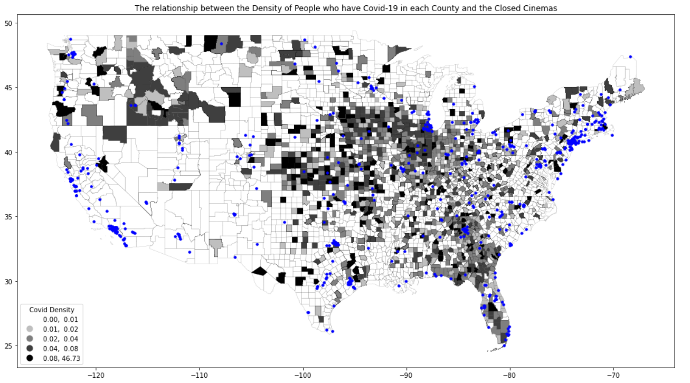

# The Impact of Covid-19 on Movie Industry and Streaming Media Development

## 1.	Motivation

The outbreak of covid-19 has limited some public activities, and the use of indoor public space such as movie theaters has been restricted. At the same time, the development of streaming media begins to provide people with new movie watching options.

In this research, the author wants to explore whether there is a correlation between covid-19 and the change of cinema numbers by means of data and geographical analysis. And further analyze whether this change has driven a shift in the way people watch movies from traditional cinemas to streaming media.

## 2. Methodology

### 2.1 Data Analysis

**Geographical Range: United States**

**Time Range: 2019-2022**

This research will use some country level data from 2019 to 2022. By observing the number of new and closed cinemas before and after the covid, we can see the impact of covid on the number of cinemas.

### 2.2 Geographical Analysis

**Geographical Range: From United States to Bay Area Counties**

**Time Range: 2020-2022**

The author will use both country and county level data in geographical analysis. By comparing the locations of new and closed cinemas with the severity level of covid-19, it is possible to analyze whether there is a correlation between them.

## 3.Data Analysis

### 3.1 The Number of Cinema

In 2019, the number of new and closed cinemas remains largely balanced, but in 2020 and 2021, the number of closed cinemas is much greater than new cinemas. And the number of closed cinemas in 2020 and 2021 is significantly higher than 2019. 

                            

                    

During 2019-2020, which is the beginning of the breakout of covid-19, the rate of growth of new cinemas is much smaller than the rate of cinemas reduction. By 2021, when the pandemic is stable, this trend begins to slow down.

                            

                    

From the monthly data, the number of closed cinemas reaches two peaks in January 2020 and October 2021, which corresponds to the severe periods of covid-19. The number of new cinemas starts to pick up in April 2021, which reflects the public judges that covid-19 is coming to an end. However, the number of new cinemas once again began to decrease due to the dire situation of the covid-19 epidemic by the winter of 2021.

                            

                    

                            

                    

                            

                    

The above data shows that the outbreak of COVID-19 has had a certain degree of impact on the operation of movie theaters.

### 3.2 Ticket Sold and Box Office

Considering that the number of movie theater is not the only indicator that can reflect the situation of movie industry, the annual box office revenue and annual ticket sales in the U.S. for the past 20 years are used here for further analysis.

The annual ticket sales in the U.S. has been relatively stable from 2002 to 2019. However, this figure declines sharply in 2020, the year in which the U.S. is most affected by COVID-19. Although the annual ticket sales in 2021 has rebounded compared to 2020, it will still only reach half of the number before the outbreak of COVID-19.

                            

                    

Box office revenues over the past 20 years reflect the same trend. After adjusting box office revenues for the past 20 years based on inflation, box office revenues in 2020 and 2021 are still much smaller than they were before the epidemic. This situation also supports the impact of COVID-19 on the film industry.

                            

                    

### 3.3 Streaming Media Subscription

The streaming media industry also changed dramatically during the COVID-19 pandemic. 

_" The BBC noted that the popularity of streaming services could increase, especially if more people are isolated at home, with The Guardian suggesting that non-blockbuster films may be sent to streaming more quickly than anticipated after release, to catch this market. One popular film to stream was 2011's Contagion, which moved up from being the 270th most-watched Warner Bros. film in December 2019 to become its 2nd most-watched film in 2020 (by March) and entered the top 10 on iTunes film rentals, ostensibly due to the similarities its story bears to the outbreak. The stock of Netflix increased in 2020 by March 12. The platform had released its original docuseries Pandemic: How to Prevent an Outbreak at the end of January 2020. Disney+ went live in India on March 11 via its domestic service Hotstar, eighteen days before it was set to, though Disney's shares had fallen by 23% on March 9."_

Here, Netflix is used as an example to analyze the changing trend of streaming media. _(The data below are all from Backlinko.)_ 

To this day, Netflix is still the world's highest market share streaming media company. Netflix has a 35% market share in the US, which is much higher than the other streaming media companies. Therefore, using Netflix as an example can prove the trend of the streaming media industry.

The following data shows that Netflix shows a significant upward trend in the number of subscribers and year revenue in 2020.

 

Meanwhile, Netflix exported more original content in 2020 than it has in the past. It can be speculated that the restriction caused by COVID-19 has prompted the streaming medias to put more effort into creating quality contents.

And according to user feedback, users are generally using Netflix for more hours in 2020 than ever before, which proved that the pandemic has prompted people to give more of their entertainment time to streaming rather than the traditional movie industry.

 

In summary, it can be presumed that the downward movement of the movie industry due to COVID-19 has brought more users to the streaming industry.

## 4.	Geographical Analysis

### 4.1 Covid-19 Population

The number of people with COVID-19 by county is shown here as of March 2021. As can be seen from the figure, the locations of the movie theaters that have closed in recent years coincide to highly extent with the areas with high numbers of COVID-19 patients.

In line with this, the locations of the new opened cinemas are also more concentrated in areas with a high number of COVID-19 patients. It is inferred that the location of the new cinemas may be related to the local cinema demand and the number of existing cinemas.

### 4.2 Community Covid-19 Level

The number of COVID-19 patients per 100,000 people was used as a measure to classify the community COVID-19 level for each county in the US. 

Nationally, the locations of the new cinemas are roughly located in medium and low-risk areas. However, they still exist in some high-risk areas. In general, the location of new cinemas does not correlate strongly with covid at the geographic level.

As for closed cinemas, they are mostly located in medium and high-risk areas. Although closed cinemas also exist in some low-risk areas, there is a closer correlation between closed cinema locations and COVID-19.

### 4.3 Density of COVID-19 Patients

The author obtained COVID-19 density data for each county by dividing the number of local COVID-19 patients by the total population. 

Since the density of COVID-19 patients did not differ significantly in the vast majority of counties, no significant correspondence between patient density and cinema location was produced.

### 4.4 Population and Population Density

Considering that the strongest correlation between cinema location and the number of COVID-19 patients was found among the above parameters, the author added a geographical analysis of the correlation between population density and the location of cinema in each county.

From the results, the locations of the new and closed cinemas were mostly concentrated in counties with high population density, which is consistent with the results of the analysis of the number of COVID-19 patients and the location of cinemas in the above section.

## 5.	Conjecture

Based on the results of the analysis, the author wants to propose a conjecture. COVID-19 is more likely to spread in areas of high population density. In such areas, the movie industry experienced a greater drop in revenue before and after the outbreak of COVID-19. As a result, movie theater operations in such areas are also more significantly impacted by COVID-19.

In the following sections, the author takes bay area counties as an example for further analysis.

### 5.1 Community Covid-19 Level in Bay Area

Based on the graphs, most bay area counties are low-risk areas, but the difference in the number of hospitalizations due to covid was not significant across counties.

                            

                    

                            

                    

We can see that the new and closed movie theaters are all located in low-risk areas. Most of them are in San Francisco, which shows that the new and closed cinema locations is influenced not only by covid, but also by other factors such as the level of urban development and population.

### 5.2 Population Density in Bay Area

Comparing the population density of the Bay Area counties with the location of movie theaters, it can be seen that the new and closed movie theaters are basically located in areas with high population density. This result is consistent with the conjecture.

## 6.	Conclusion

In terms of quantity, covid has had an impact on the change in cinema numbers in the United States. And both the number of new and closed cinemas will be affected.

The new and closed cinema locations are related to covid. The locations of the closed cinemas are more affected. But cinema location is not linearly related to covid. It is influenced by a number of factors simultaneously. Covid is not the most dominant factor among them.

The location of new and closed cinemas corresponds closely to the local population density and the number of COVID-19 patients. Based on corroborating speculation, the movie industry would be more affected by the pandemic in areas with higher population density due to the higher number of COVID-19 patients.

## 7.	References

**[1] Impact of the COVID-19 pandemic on cinema from Wikipedia.**

_https://en.wikipedia.org/wiki/Impact_of_the_COVID-19_pandemic_on_cinema_

**[2] Quick Stats About Movie Theaters In United States from SafeGraph.**

_https://shop.safegraph.com/data?categories=512131&countries=US&tab=core_

**[3] United States COVID-19 Community Levels by County from Centers for Disease Control and Preventioin.**

_https://data.cdc.gov/Public-Health-Surveillance/United-States-COVID-19-Community-Levels-by-County/3nnm-4jni_

**[4] 2020 Census Demographic Data By County from Data Emporium.**

_https://www.dataemporium.com/dataset/254/?gclid=Cj0KCQjw1N2TBhCOARIsAGVHQc7SQxgUEthlW3WAGCIZINBxuiceFD7YXU_LgdUyGzcufRc1NX4sp_IaAlaGEALw_wcB_

**[5] Geojson and KML data for the United States from Eric Tech.**

_https://eric.clst.org/tech/usgeojson/_

**[6] Netflix Subscriber and Growth Statistics: How Many People Watch Netflix in 2022? from BackLinko.**

_https://backlinko.com/netflix-users_

**[7] Box office in the U.S. - statistics & facts from Statista.**

_https://www.statista.com/topics/852/box-office/_
